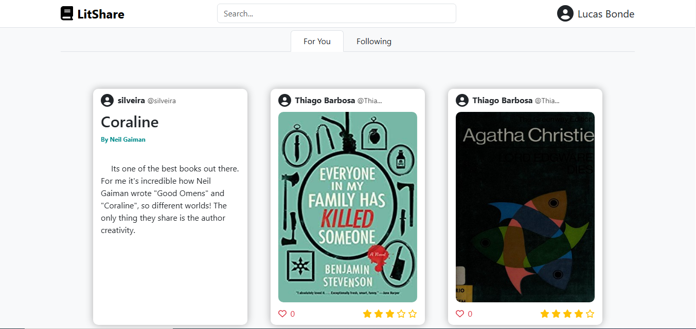

# 📚 LitShare

**LitShare** é uma plataforma moderna para compartilhar, curtir e seguir leitores e livros! Um projeto completo com frontend em React e backend em Node.js.



---

## 🚀 Tecnologias Utilizadas

### Frontend
- [React](https://reactjs.org/)
- [Vite](https://vitejs.dev/)
- [JavaScript](https://developer.mozilla.org/pt-BR/docs/Web/JavaScript)

### Backend
- [Node.js](https://nodejs.org/)
- [Express](https://expressjs.com/)

---

## 🔧 Como Executar Localmente

### Pré-requisitos
- Node.js instalado

### Backend

```bash
cd backend
npm install
npm run dev
```
*A API estará disponível em: http://localhost:3000*
